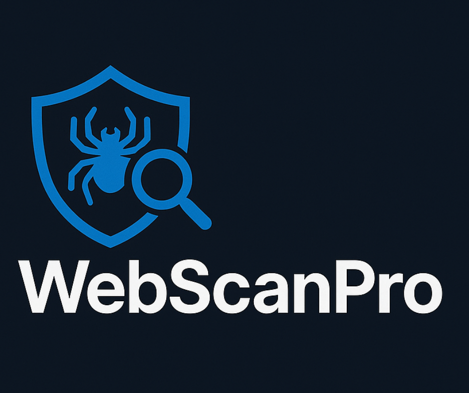

<div align="center">
  
<h1 align="center">
    
</h1>
  
  

  <h1>Scan Smarter, Stay Safer.</h1>
  
  <p>
    Welcome to WebScanPro — your gateway to intelligent, lightning-fast vulnerability detection and total web security control.
  </p>
  
  
<!-- Badges -->
<p>
  <a href="https://github.com/Raouf-Braham/WebScanPro//graphs/contributors">
    
  </a>
  <a href="">
    
  </a>
  <a href="https://github.com/Raouf-Braham/WebScanPro/network/members">
    
  </a>
  <a href="https://github.com/Raouf-Braham/WebScanPro">
    
  </a>
  <a href="https://github.com/Raouf-Braham/WebScanPro/issues/">
    
  </a>
  <a href="https://github.com/Raouf-Braham/WebScanPro/blob/master/LICENSE">
    
  </a>
</p>
   
<h4>
    <a href="https://github.com/Raouf-Braham/WebScanPro">Documentation</a>
  <span> · </span>
    <a href="https://github.com/Raouf-Braham/WebScanPro/issues/">Report Bug</a>
  <span> · </span>
    <a href="https://github.com/Raouf-Braham/WebScanPro/issues/">Request Feature</a>
  </h4>
</div>

<br />

<!-- Table of Contents -->
# Table of Contents

- [About the Project](#about-the-project)
  * [Mission](#mission)
  * [Tutorial](#tutorial)
  * [Tech Stack](#tech-stack)
  * [Features](#features)
  * [Color Reference](#color-reference)
- [Getting Started](#getting-started)
  * [Run Locally](#run-locally)
- [Usage](#usage)
- [Roadmap](#roadmap)
- [Contributing](#contributing)
  * [Code of Conduct](#code-of-conduct)
- [License](#license)
- [Contact](#contact)
- [Acknowledgements](#acknowledgements)
  

<!-- About the Project -->
## About the Project

<!-- Mission -->
### Mission
To simplify and automate web security testing, making it accessible to everyone. WebScanPro empowers users to identify and mitigate security risks through intuitive dashboards, modular tool integration, and reliable reporting — without requiring deep expertise in cybersecurity.

<!-- Tutorial -->
### Tutorial

<p>New to WebScanPro? Here's how to get started: First, sign up / login as a client or admin. Second, launch a Scan via the dashboard using tools like Nmap, Subfinder, or ZAP.
  Each tool's simulation is built to give users real-time feedback and a hands-on experience.
</p>
<br>

https://github.com/user-attachments/assets/4a5f5e4a-54f2-4e70-b304-d41a0fe90fa0


<!-- TechStack -->
### Tech Stack

<details>
  <summary>Client</summary>
  <ul>
    <li><a href="https://www.javascript.com/">JavaScript</a></li>
    <li><a href="https://jquery.com/">jQuery</a></li>
    <li><a href="https://html.com/html5/">HTML5</a></li>
    <li><a href="https://www.w3.org/Style/CSS/Overview.en.html">CSS3</a></li>
    <li><a href="https://getbootstrap.com/">Bootstrap</a></li>
  </ul>
</details>

<details>
  <summary>Server</summary>
  <ul>
    <li><a href="https://flask.palletsprojects.com/en/stable/">Flask</a></li>
  </ul>
</details>

<!-- Features -->
### Features

• Automated vulnerability scanning

• Subfinder, Nmap, OWASP ZAP, Gophish integration

• Full scan history and report access

• Real-time alerts & notifications

• Configurable test options per user

• Exportable audit-ready reports

<!-- Color Reference -->
### Color Reference

| Color | Hex |
| ------ | ---- |
| Primary Color |  `#00427E` |
| Secondary Color |  `#121212` |
| Accent Color |  `#222222` |
| Text White |  `#F5F5F5` |


<!-- Getting Started -->
## Getting Started

<!-- Run Locally -->
### Run Locally

Clone the project

```bash
  git clone https://github.com/Raouf-Braham/WebScanPro.git
```

Go to the project directory

```bash
  cd my-project
```

<!-- Usage -->
## Usage

• Launch the app via localhost:5000

• Register or login to access the dashboard

• Start scanning using integrated tools

• View detailed reports in your history tab

• Manage account settings and scan preferences

<!-- Roadmap -->
## Roadmap
🔄 Add AI-powered vulnerability classification

📈 Interactive reporting dashboards

📤 Integration with Slack & Jira

🧠 Risk scoring and automated patch recommendations

🌐 Multi-language support

☁️ Cloud scan agent deployment

<!-- Contributing -->
## Contributing

<a href="https://github.com/Raouf-Braham/WebScanPro/graphs/contributors">
  
</a>

<a href="https://github.com/HoussemEddinChaouach-eniso">
  
</a>


Contributions are always welcome!

See `contributing.md` for ways to get started.


<!-- Code of Conduct -->
### Code of Conduct

Please read the [Code of Conduct](https://github.com/Raouf-Braham/WebScanPro/blob/master/CODE_OF_CONDUCT.md)

<!-- License -->
## License

Distributed under the no License. See LICENSE.txt for more information.


<!-- Contact -->
## Contact

Linkedin - [@Raouf Braham](https://www.linkedin.com/in/raouf-braham/) [@Houssem Eddin Chaouach](https://www.linkedin.com/in/houssem-eddin-chaouach-2042592a7/) | Email - raouf.brahem@eniso.u-sousse.tn houssemeddine.chaouach@eniso.u-sousse.tn

Project Link: [https://github.com/Raouf-Braham/WebScanPro](https://github.com/Raouf-Braham/WebScanPro)


<!-- Acknowledgments -->
## Acknowledgements

• Inspired by tools like Subfinder, ZAP, and Intruder.

• Technologies from the Flask, HTML5 and CSS3 communities.
